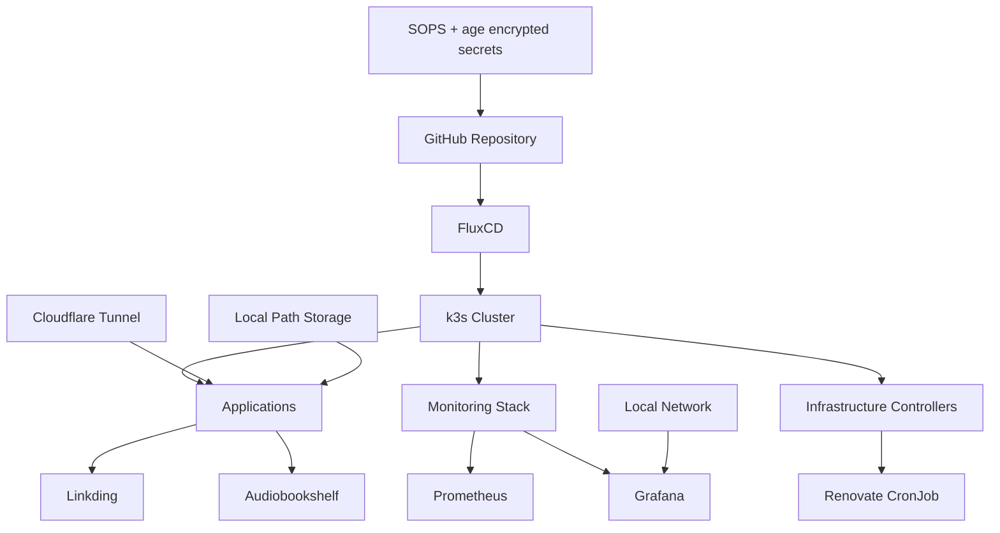

# Kubernetes Homelab

Self-hosted Kubernetes homelab built on low-power hardware to learn, test, and demonstrate practical DevOps skills.

This repository is used as the source of truth for my Kubernetes cluster. It contains declarative configuration for applications, infrastructure components, monitoring, secrets, and automated dependency updates.

The project is intentionally small, but it follows production-like patterns such as GitOps, encrypted secrets, persistent storage, monitoring, controlled external access, and pull-request based updates.

## Goals

This homelab was created for two main reasons:

1. To build a real environment for learning Kubernetes, GitOps, monitoring, security, and infrastructure operations.
2. To demonstrate hands-on DevOps skills through a working infrastructure project.

## Current Status

The cluster currently runs as a single-node k3s setup on one HP T520 thin client.

The target architecture is a 3-node cluster:

- 1 control plane node
- 2 worker nodes

The next planned step is to rebuild and expand the cluster using Omni.

## Hardware

### Current node

| Component | Specification |
|---|---|
| Model | HP T520 Thin Client |
| CPU | AMD GX-212JC |
| RAM | 4 GB DDR3 |
| Storage | 32 GB SSD MLC |

### Planned cluster

| Role | Hardware |
|---|---|
| Control plane | HP T520 Thin Client |
| Worker 1 | HP T520 Thin Client |
| Worker 2 | HP T520 Thin Client |

There is currently no separate NAS or external storage server. Persistent volumes are provided using local Kubernetes storage.

## Kubernetes

The cluster currently runs on [k3s](https://k3s.io/), a lightweight Kubernetes distribution.

The initial installation uses the default k3s configuration, with the built-in Helm controller disabled:

```bash
curl -sfL https://get.k3s.io | INSTALL_K3S_EXEC="--disable=helm-controller" sh
```

## Bootstrap and Node Joining

### Current k3s bootstrap

The current cluster bootstrap process is manual and intentionally simple.

The first node is installed as a single-node k3s server on Ubuntu Server:

```bash
curl -sfL https://get.k3s.io | INSTALL_K3S_EXEC="--disable=helm-controller" sh -
```

After the server node is running, additional worker nodes can be joined to the cluster by installing k3s in agent mode and pointing the node to the existing server API endpoint:

```bash
curl -sfL https://get.k3s.io | \
  K3S_URL=https://<control-plane-ip>:6443 \
  K3S_TOKEN=<node-token> \
  sh -
```

The real node token is not stored in this repository and must never be committed to Git.

After a new node joins the cluster, it can be verified with:

```bash
kubectl get nodes -o wide
```

### Planned Omni-based rebuild

The next planned step is to rebuild the homelab using Omni and move from the current single-node k3s setup to a 3-node Kubernetes cluster.

The planned target is:

- 1 control plane node
- 2 worker nodes
- all nodes running on HP T520 thin clients

Omni is planned as a future improvement for machine and cluster lifecycle management. This part is not implemented yet and is tracked in the roadmap.

## GitOps

Applications and infrastructure components are managed declaratively from this repository using FluxCD.

The workflow is:

1. Make changes in this repository.
2. Commit and push changes to GitHub.
3. FluxCD detects changes in the repository.
4. FluxCD reconciles the desired state from Git with the actual state of the Kubernetes cluster.

Git is the source of truth for the cluster state.

The cluster is currently bootstrapped manually. After FluxCD is installed and connected to this repository, applications, infrastructure components, and monitoring are managed through GitOps.

Planned improvements:

- document the full FluxCD bootstrap process
- document manual k3s bootstrap and worker node joining
- document the future Omni-based rebuild process
- add repeatable bootstrap instructions
- split the environment into staging and production

## Repository Structure

```text
.
├── apps/              # Application manifests
├── clusters/          # Environment-specific cluster configuration
├── infrastructure/    # Infrastructure controllers and supporting services
├── monitoring/        # Monitoring stack configuration
└── renovate.json      # Renovate configuration
```

## Architecture



## Applications

### Linkding

Self-hosted bookmark manager used as an alternative to browser-based bookmarks.

Implemented with:

- Kubernetes Deployment
- Kubernetes Service
- PersistentVolumeClaim
- non-root container configuration
- Cloudflare Tunnel exposure

### Audiobookshelf

Self-hosted audiobook server.

Implemented with:

- Kubernetes Deployment
- Kubernetes Service
- multiple PersistentVolumeClaims
- non-root container configuration
- Cloudflare Tunnel exposure

### Renovate

Renovate is used for automated dependency and container image updates.

In this cluster, Renovate runs as a Kubernetes CronJob and creates pull requests with available updates.

Current schedule:

```text
Every hour
```

## Networking

Selected applications are exposed through Cloudflare Tunnel using a custom domain and application-specific subdomains.

Current access model:

| Component | Access |
|---|---|
| Linkding | Cloudflare Tunnel |
| Audiobookshelf | Cloudflare Tunnel |
| Grafana | Local network only |

Grafana is intentionally available only from the local network.

## Storage

The cluster currently uses local path storage.

Persistent volumes are used for stateful applications such as:

- Linkding
- Audiobookshelf

Current limitations:

- no external storage backend
- no dedicated NAS
- no automated backup system yet

## Secrets Management

Secrets are encrypted using SOPS with age.

The age private key is stored outside of this repository and used from the local development environment/devcontainer. Sensitive values are committed only in encrypted form.

Rules used in this repository:

- plaintext secrets are not committed
- Kubernetes secrets are stored in Git only after encryption
- SOPS + age is used for secret encryption and decryption
- the age private key is stored outside of the repository

### Editing an existing encrypted secret

```bash
sops secret.yaml
```

### Creating a new encrypted Kubernetes secret

```bash
kubectl create secret generic example-secret \
  --from-literal=username=example \
  --from-literal=password=example \
  --dry-run=client \
  -o yaml > secret.yaml

sops --encrypt --in-place secret.yaml
```

If a `.sops.yaml` configuration file is present, SOPS will use the repository encryption rules automatically.

## Monitoring

Monitoring is provided by kube-prometheus-stack.

The stack provides Kubernetes monitoring components such as:

- Prometheus
- Grafana
- Alertmanager
- Prometheus Operator
- ServiceMonitor and PodMonitor support
- predefined Kubernetes dashboards and alerting rules

Grafana is available only from the local network.

## Security

Current security practices:

- containers run as non-root where possible
- `securityContext` is configured for workloads
- privilege escalation is disabled where possible
- secrets are encrypted with SOPS and age
- public access is limited to selected applications exposed through Cloudflare Tunnel
- internal services such as Grafana are kept local-only

Not implemented yet:

- Kubernetes NetworkPolicies
- automated backup and restore process
- full multi-node high availability setup

## Backup Strategy

Automated backups are not configured yet.

This is a planned improvement. Future backup options may include:

- Restic
- Kopia
- Longhorn backups
- application-level export and restore procedures
- storage-level backup strategy after the cluster is rebuilt

## Roadmap

Planned improvements:

- migrate from a single-node k3s cluster to a 3-node setup
- rebuild and expand the cluster using Omni
- add production environment next to staging
- implement backup and restore strategy
- add Kubernetes NetworkPolicies
- ~~improve resource requests and limits~~ - done
- add readiness and liveness probes where possible
- improve monitoring and alerting

## What This Project Demonstrates

This project demonstrates practical experience with:

- Kubernetes
- k3s
- FluxCD
- GitOps
- declarative infrastructure management
- SOPS and age encrypted secrets
- persistent storage
- self-hosted applications
- Cloudflare Tunnel
- monitoring with Prometheus and Grafana
- automated dependency updates with Renovate
- container security basics
- working with real infrastructure constraints

## Notes

This is a homelab project, not a production-grade high availability platform yet.

The goal is to build the project incrementally, document decisions, and continuously improve it using real DevOps practices.
